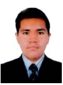
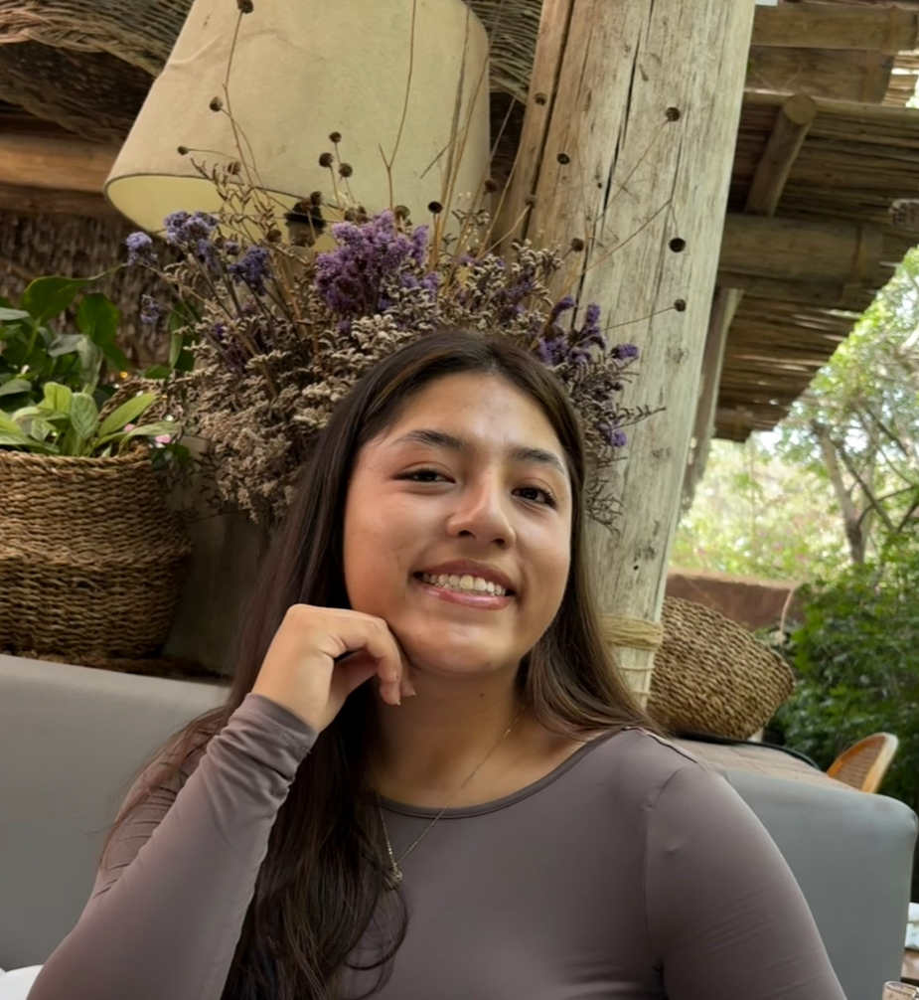
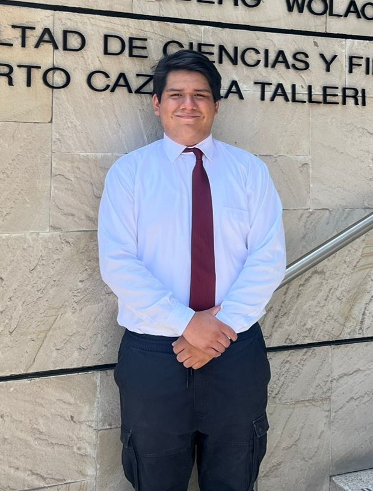

<h1 align="center" style="color:red">Introducción a Señales Biomédicas 2025-II</h1>

<h1 align="center"><small>✨Repositorio del Grupo 2✨</small></h1>

  

## Introducción: 📚
¡Bienvenidos al repositorio oficial del **Grupo 2** del curso **Introducción a Señales Biomédicas 2025-II**!
Durante el desarrollo del curso compartiremos nuestros avances, que contendrán materiales, códigos y documentación del grupo para el proyecto y los laboratorios. Asimismo, registraremos nuestros progresos y análisis.
## Objetivo: 🎯
Nuestro objetivo es poder contribuir al conocimiento y a la mejora de las tecnologías aplicadas en salud, explorando, aprendiendo y aplicando conceptos en señales biomédicas mediante un enfoque práctico y colaborativo.

## Motivación: 💡
Nos motiva aplicar la ingeniería a problemas reales de salud, convirtiendo los conceptos de señales biomédicas en soluciones útiles para la detección y el monitoreo. Queremos aprender haciendo, colaborar con rigor y mantener buenas prácticas con ética y privacidad.
## Integrantes: 👥

| Foto | Presentación |
|:---:|---|
|  | **Angel David Cebrian Jauregui** Soy estudiante de 8vo ciclo. Mis áreas de interés son **Ingeniería de Tejidos y Señales e Imágenes Biomédicas**. Tengo experiencia en biomateriales y Tiny Machine Learning. <a href="https://www.linkedin.com/in/angel-david-cebrian-jauregui-a96927306/"> Angel David Cebrian Jauregui      *angel.cebrian@upch.pe* |
|  | **Luciana Valeria Tarazona Alamo** Soy estudiante de 8vo ciclo. Mis áreas de interés son **Ingeniería Clínica, Biomecánica y Rehabilitación**. He colaborado en proyectos de dispositivos para salud y realicé una pasantía en el Laboratorio de Docencia en Ingeniería (UPCH).  <a href="https://www.linkedin.com/in/luciana-valeria-tarazona-alamo-1b82442b7?utm_source=share&utm_campaign=share_via&utm_content=profile&utm_medium=ios_app">  *Luciana Valeria Tarazona Alamo*    *luciana.tarazona@upch.pe*|
|  | **Fabrizio Fernando Vega Gamboa** Soy estudiante de 8vo ciclo del pregrado de Ingeniería Biomédica. Mis áreas de interés son **Ingeniería de Tejidos y Biomateriales**. Colaboro en un proyecto en el Laboratorio de Modificación de Materiales de la PUCP.  <a href="https://www.linkedin.com/in/fabrizio-fernando-vega-gamboa-b843b9281/">  *Fabrizio Fernando Vega Gamboa*    *fabrizio.vega@upch.pe*|

## Docentes 👨‍🏫

  

- [Moises Stevend Meza Rodriguez](https://ctivitae.concytec.gob.pe/appDirectorioCTI/VerDatosInvestigador.do?id_investigador=23798)

  

- [Umbert Lewis De la Cruz Rodriguez](https://ctivitae.concytec.gob.pe/appDirectorioCTI/VerDatosInvestigador.do?id_investigador=160463)

  

- [Jose Alonso Caceres Del Aguila](https://dina.concytec.gob.pe/appDirectorioCTI/VerDatosInvestigador.do;jsessionid=734eb3d1291354c98c5bafdfbdf8?id_investigador=203971)

